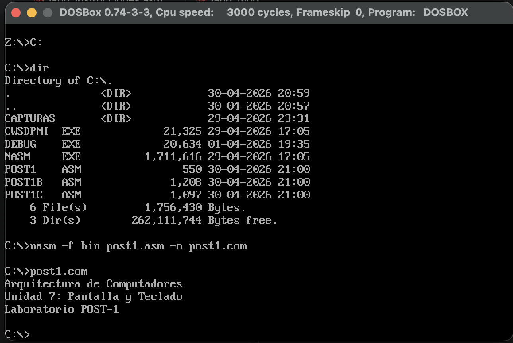
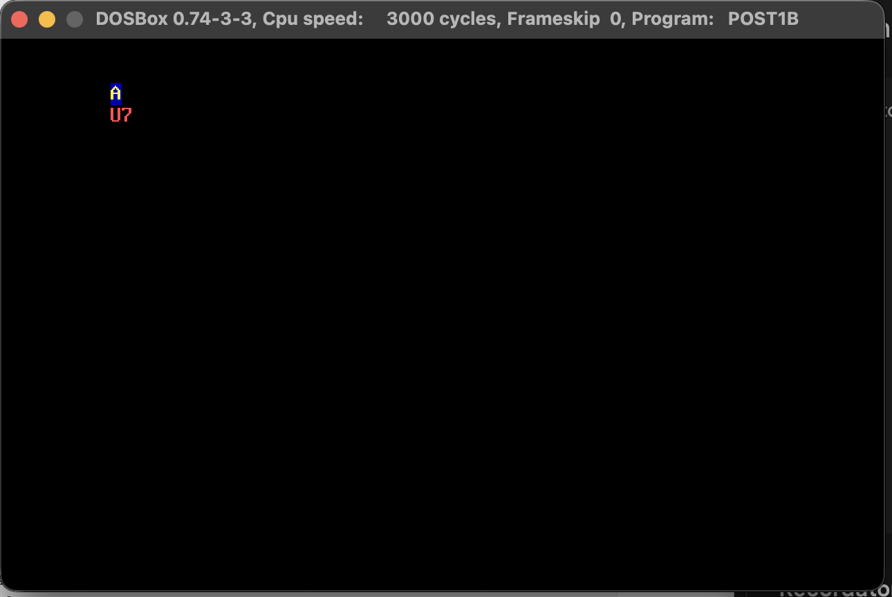
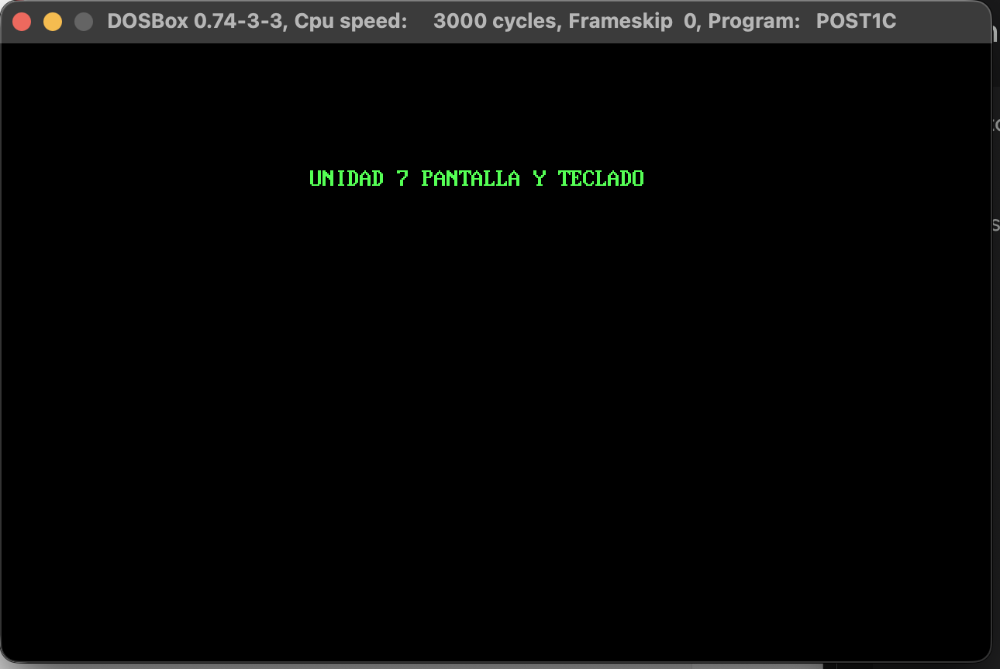

# Laboratorio: Manejo de Pantalla y Teclado (Unidad 7)

## Información del Estudiante
* **Nombre:** Andrea Valentina Rivera Fernández
* **Institución:** Universidad Francisco de Paula Santander (UFPS)
* **Carrera:** Ingeniería de Sistemas
* **Materia:** Arquitectura de Computadores
* **Fecha:** Abril, 2026

## Objetivos
* Implementar servicios de salida de texto mediante la interrupción `INT 21h`.
* Controlar el cursor y atributos de color utilizando los servicios de video de la BIOS (`INT 10h`).
* Desarrollar algoritmos para el posicionamiento exacto de cadenas en modo texto[cite: 3].

---

## Checkpoint 1: Salida de Texto Básica (`post1.asm`)
En esta fase se utilizó la función `09h` de la `INT 21h` para imprimir múltiples líneas de texto terminadas con el carácter `$`[cite: 3].

*(Referencia: captura donde se muestra la compilación con NASM y las 3 líneas impresas)*

**Resultado:**
El programa muestra exitosamente los títulos de la materia, la unidad y el laboratorio en líneas separadas[cite: 3].

---

## Checkpoint 2: Control de Cursor y Atributos (`post1b.asm`)
Se implementó el uso de la `INT 10h` para manipular la estética de la pantalla[cite: 3]. Se utilizaron las siguientes funciones:
* **AH=06h:** Limpiar la pantalla[cite: 3].
* **AH=02h:** Posicionar el cursor en coordenadas específicas[cite: 3].
* **AH=09h:** Escribir caracteres con atributos de color[cite: 3].

*(Referencia: captura de pantalla con fondo negro, "A" azul/amarilla y "U7" rojo claro)*

**Evidencia Técnica:**
* Se logró imprimir la letra **"A"** con atributo `1Eh` (texto amarillo sobre fondo azul) en la fila 2[cite: 3].
* Se imprimió **"U7"** con atributo `0Ch` (rojo claro sobre negro) en la fila 3[cite: 3].

---

## Checkpoint 3: Cadena en Posición Exacta (`post1c.asm`)
Se desarrolló un bucle para recorrer una cadena carácter por carácter, posicionando el cursor dinámicamente antes de cada impresión[cite: 3].

*(Referencia: captura de pantalla con el título verde centrado)*

**Análisis del Bucle:**
* **Registro SI:** Utilizado como puntero para recorrer la cadena `titulo`[cite: 3].
* **Atributo 0Ah:** Se aplicó color verde brillante sobre fondo negro para toda la cadena[cite: 3].
* **Posicionamiento:** El título aparece centrado en la fila 5 gracias al incremento constante de la columna en el registro `DL`[cite: 3].

---

## Conclusiones
1. La interrupción **INT 10h** es fundamental para el desarrollo de interfaces de usuario en modo texto, permitiendo una organización visual superior a la salida secuencial simple[cite: 3].
2. La gestión de atributos de color (4 bits para fondo, 4 bits para texto) permite una personalización completa del entorno visual bajo la arquitectura x86[cite: 3].
3. El uso de bucles para posicionamiento manual garantiza que el programador tenga control total sobre la ubicación de cada elemento en la matriz de $80 \times 25$ caracteres[cite: 3].
